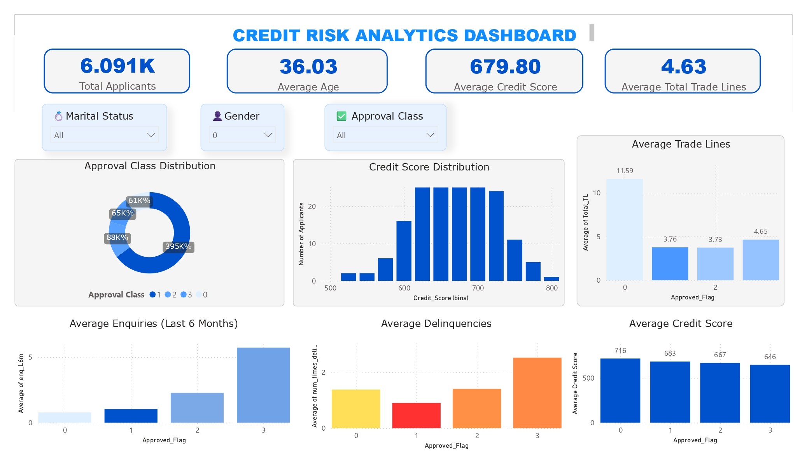

# 🏦 Credit Risk Analytics

<p align="center">
  
</p>

<p align="center">
An end-to-end Credit Risk Analytics project combining Exploratory Data Analysis, Feature Engineering,
Machine Learning, and Business Intelligence using Python and Power BI.
</p>

---

# 📖 About the Project

Financial institutions receive thousands of loan applications every day.

Before approving a loan, they need to answer one important question:

> **Is this applicant likely to repay the loan?**

In this project, I explored a real-world credit risk dataset to understand what differentiates low-risk and high-risk applicants.

Rather than focusing only on building a machine learning model, I also investigated the business meaning behind the data, engineered meaningful features, and created an interactive Power BI dashboard to communicate the results.

---

# 🎯 Project Objectives

✔ Understand the dataset and business problem

✔ Clean and prepare the data

✔ Explore applicant characteristics

✔ Engineer meaningful features

✔ Build a credit approval prediction model

✔ Visualize insights through an interactive dashboard

---

# 🗂 Project Workflow

```
Raw Loan Data
      │
      ▼
01. Data Understanding
      │
      ▼
02. Data Cleaning
      │
      ▼
03. Exploratory Data Analysis
      │
      ▼
04. Feature Engineering
      │
      ▼
05. Model Building
      │
      ▼
Power BI Dashboard
```

---

# 📁 Repository Structure

```
Credit-Risk-Analytics
│
├── notebooks/
│   ├── 01_data_understanding.ipynb
│   ├── 02_data_cleaning.ipynb
│   ├── 03_exploratory_data_analysis.ipynb
│   ├── 04_feature_engineering.ipynb
│   └── 05_model_building.ipynb
│
├── dashboard/
│   ├── Dashboard.jpg
│   └── Exploratory Analysis of Loan Applicants.pbit
│
├── data/
│
└── README.md
```

---

# 📚 Notebook Guide

## 📘 01 - Data Understanding

In this notebook I:

- Explored every feature in the dataset
- Understood the target variable
- Identified numerical and categorical variables
- Learned what each credit-related feature represents

---

## 🧹 02 - Data Cleaning

In this notebook I:

- Removed unnecessary columns
- Fixed missing values where appropriate
- Checked data quality
- Prepared the dataset for analysis

---

## 📊 03 - Exploratory Data Analysis

In this notebook I explored:

- Credit score distribution
- Approval class distribution
- Applicant demographics
- Loan history
- Delinquency trends
- Trade lines
- Correlation between important variables

The goal here was to understand the data before building any model.

---

## ⚙️ 04 - Feature Engineering

This notebook contains the most important preprocessing work.

I:

- Encoded categorical variables
- Investigated structural missing values
- Removed duplicate features
- Investigated highly correlated variables
- Preserved business meaning while engineering features
- Prepared the final training dataset

Instead of blindly applying preprocessing techniques, every decision was based on business reasoning.

---

## 🤖 05 - Model Building

In this notebook I:

- Split the data into training and testing sets
- Trained a Random Forest classifier
- Evaluated model performance
- Examined feature importance

The resulting model achieved strong predictive performance while remaining interpretable.

---

# 📈 Dashboard

The Power BI dashboard summarizes the key characteristics of loan applicants.

### KPI Cards

- Total Applicants
- Average Age
- Average Credit Score
- Average Trade Lines

### Interactive Filters

- Marital Status
- Gender
- Approval Class

### Visualizations

- Approval Class Distribution
- Credit Score Distribution
- Average Credit Score by Approval Class
- Average Trade Lines by Approval Class
- Average Recent Enquiries (Last 6 Months)
- Average Delinquencies by Approval Class

---

# 💡 Key Insights

Some interesting findings from the analysis:

- Applicants with better approval status generally have higher credit scores.

- Better-approved applicants tend to have longer credit histories and more trade lines.

- Higher-risk applicants show more recent credit enquiries.

- Delinquency increases as approval quality decreases.

- Credit Score is the strongest predictor of loan approval.

---

# 🛠 Technologies Used

### Programming

- Python

### Libraries

- Pandas
- NumPy
- Matplotlib
- Seaborn
- Scikit-learn

### Business Intelligence

- Power BI Desktop
